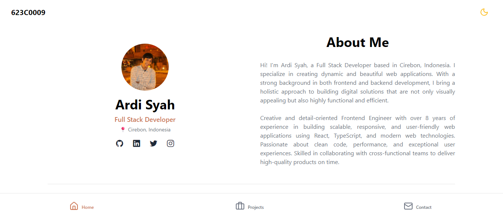
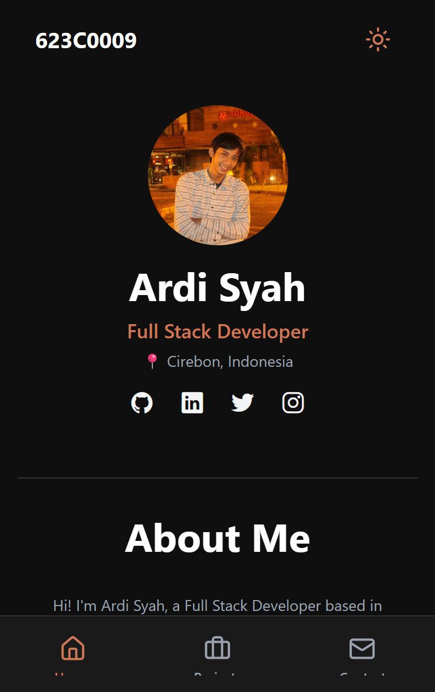
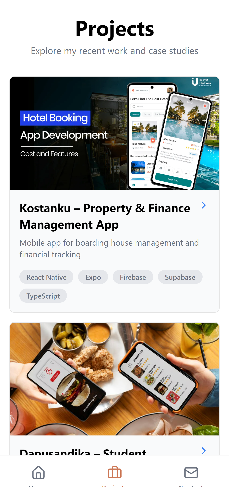
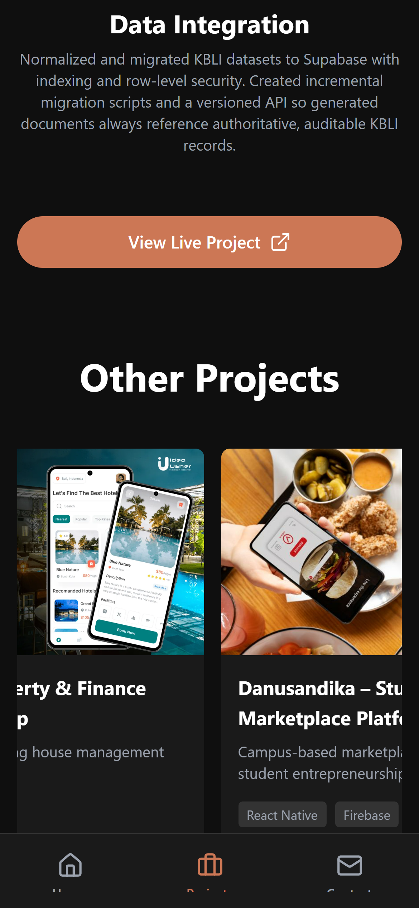
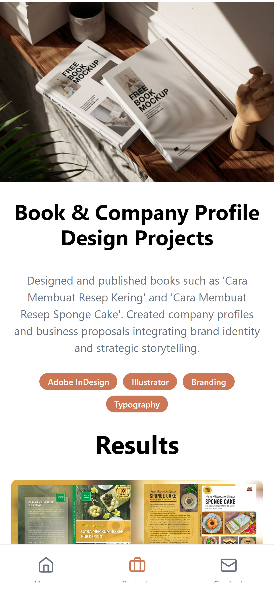
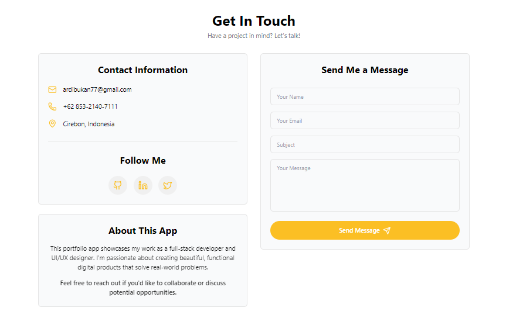
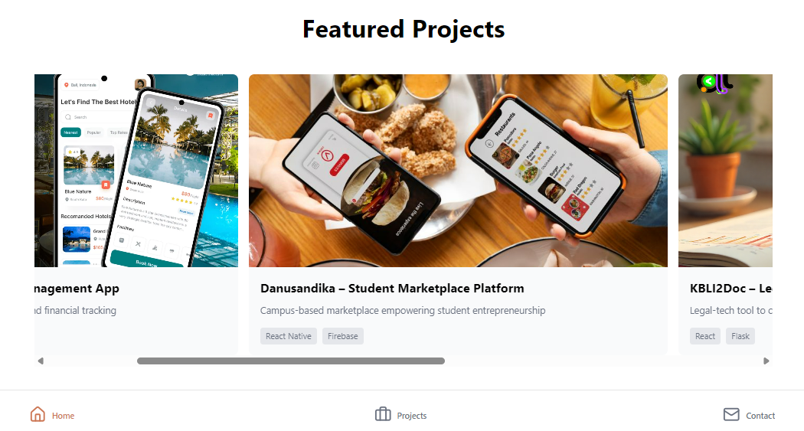

# Portfolio App - Expo React Native

## UTS Project - Semester 5

- Nama: **Ardiyansyah**
- NPM : 623C0009
- Dosen : **Mohammad Firdaus, M.Kom.**

## Captures

## Features

- **Dark/Light Theme**
- **Responsive Layout**: Optimized for mobile devices
- **Three Main Screens**:
  - **Home**: Hero section with profile, skills, experience, projects preview, and analytics
  - **Projects**: Detailed project listing with individual project detail pages
  - **Contact**: Contact information and message form

## App Screenshots

  
  
  
  

## Getting Started

cd pem-mobile-2/meet-7-uts/portfolio-app

### Prerequisites

- Node.js 16+
- Expo CLI: `npm install -g expo-cli`

### Installation

1. Clone the repository

2. Install dependencies:
   \`\`\`bash
   npm install
   \`\`\`

3. Start the development server:
   \`\`\`bash
   npm start
   \`\`\`

4. Open in Expo Go app or press:
   - `i` for iOS simulator
   - `a` for Android emulator
   - `w` for web

## Features

### Home Screen
- Profile hero section with avatar, name, title, and location
- About me section
- Experience timeline
- Skills with progress bars
- Featured projects carousel

### Projects Screen
- Grid/list view of all projects
- Project cards with tags
- Navigation to detailed project pages

### Project Detail
- Full project description
- Technology stack
- Results section with multiple images
- Call-to-action button

### Contact Screen
- Contact information display
- Social media links
- Contact form with validation
- Theme-aware styling

  

## Responsive Design

The app is fully responsive with:
- Mobile-first approach
- Adaptive layouts based on screen size
- Flexible spacing and typography

  

## Performance Optimizations

- Lazy loading of project images
- Efficient re-renders with proper memoization
- Optimized ScrollView performance
- Minimal bundle size with tree-shaking

## Browser Support

Works on:
- Expo Go SDK 54.0.21
- Android 5+
- Web (via Expo Web)

## Support

For issues or questions, please open an issue in the repository.
